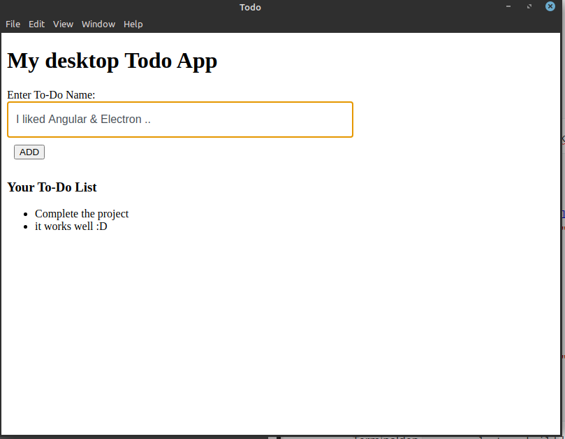
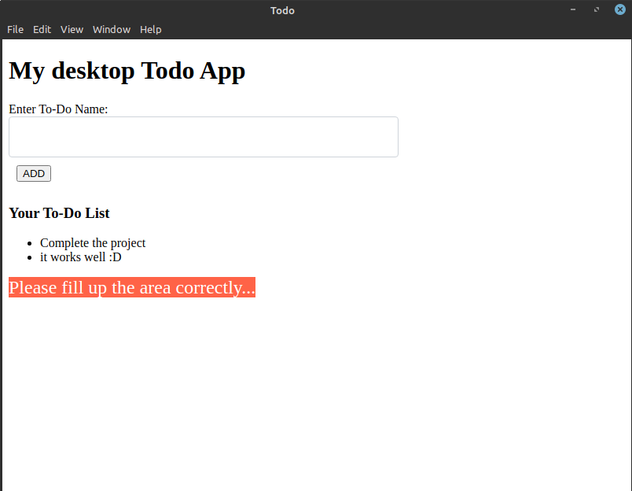

# Angular & Electron ile Masaüstü Uygulama Geliştirmeye Giriş

## Kurulumlar

- `npm install -g @angular/cli` diyerek Angular CLI kuruyoruz.

- `ng new todo` komutu ile `todo` adındaki Angular projesini başlatıyoruz.

- `cd todo` komutu ile proje klasörüne geçiş yapıyoruz.

- `npm install electron --save-dev` diyerek projemize electron'u dahil ediyoruz.

- Proje ana dizinine `main.js` adında bir dosya oluşturuyoruz.

- `package.json` dosyasını açarak aşağıdaki gibi düzenleme yapalım:

- ```javascript
  "name": "todoce",
    "version": "0.0.0",
    "main": "main.js",                                        <= eklenen satır
    "scripts": {
      "ng": "ng",
      "start": "ng serve",
      "build": "ng build",
      "test": "ng test",
      "lint": "ng lint",
      "e2e": "ng e2e",
      "electron": "electron .",                               <= eklenen satır
      "electron-build": "ng build --prod && electron ."       <= eklenen satır
    },
  
  ```

- `angular.json` dosyasında `outputPath` satırını `"outputPath": "dist"` olarak değiştiriyoruz.

- `src` klasöründe `index.html` dosyasında `<base href="/">` satırında **slash** başına nokta koyarak `<base href="./">` olarak değiştiriyoruz.

- **`main.js`** dosyasını açarak aşağıdaki gibi düzenleme yapalım

- ```javascript
  const { app, BrowserWindow } = require('electron');
  
  let win;
  
  function createWindow() {
      win = new BrowserWindow({
          width: 800,
          height: 600,
          backgroundColor: '#ffffff',
          icon: ''
      })
  	// Show the content on created window
      win.loadURL(`file://${__dirname}/dist/index.html`);
      // uncomment below to open devtools
      // win.webContents.openDevTools();
  
      win.on('closed', function () {
          win = null;
      })
  }//end-createWindow
  
  // create window  on electron initialization
  app.on('ready', createWindow)
  // Quit all windows are closed
  app.on('window-all-closed', function () {
      // on macos specific close process
      if (process.platform !== 'darwin') {
          app.quit();
      }
  })
  app.on('activate', function () {
      // macOs specific close process
      if (win === null) {
          createWindow();
      }
  })
  ```

- `app.component.ts` dosyasını aşağıdaki gibi düzenleyelim

- ```typescript
  import { Component } from '@angular/core';
  
  @Component({
    selector: 'app-root',
    templateUrl: './app.component.html',
    styleUrls: ['./app.component.css']
  })
  export class AppComponent {
    todo = '';
    alertMessage = '';
    todos: Array<String> = [];
  
  
    addNewTodo(todo) {
      if (todo) {
        this.todos.push(todo);
        this.alertMessage = "";
        this.todo = '';
      } else {
        this.alertMessage = "Please fill up the area correctly..."
      }
    }
  
  }
  
  ```

- `app.component.html` dosyasını aşağıdaki gibi düzenleyelim

- ```html
  <h1>My desktop Todo App</h1>
  
  <label for="todoName">Enter To-Do Name: </label>
  <input class="todoStyle" [(ngModel)]="todo" type="text" id="todoName">
  <button (click)="addNewTodo(todo)" style="margin: 10px;">ADD</button>
  <h3>Your To-Do List</h3>
  <ul>
    <li *ngFor="let todo of todos">
      {{ todo }}
    </li>
  </ul>
  
  <span *ngIf="alertMessage" style="font-size: 24px; color: white; background-color: tomato;">
    {{ alertMessage }}
  </span>
  ```

- Terminalden `npm run electron-build` komutunu vererek projemizi build edip çalışır halini görelim.

- 

- 

- `sudo npm install electron-packager -g` komutu ile electron-packager'ı sisteminize kurabilirsiniz.

- `electron-packager . --platform=linux` linux platformlarda çalışması için projemizin executable dosyasını ve dependencies dosyalarını oluşturuyoruz.

- ```bash
  $ electron-packager . --platform=linux
  Packaging app for platform linux x64 using electron v10.1.1
  Wrote new app to /home/krcs/projects/todo/todo-linux-x64
  
  ```

- Projemiz `todo-linux-x64` dizininde oluşturuldu.

- ```bash
  kaya @ adnan ~/projects/todo/todo-linux-x64 (master) ls
  chrome_100_percent.pak  libEGL.so             libvulkan.so            resources          todo
  chrome_200_percent.pak  libffmpeg.so          LICENSE                 resources.pak      v8_context_snapshot.bin
  chrome-sandbox          libGLESv2.so          LICENSES.chromium.html  snapshot_blob.bin  version
  icudtl.dat              libvk_swiftshader.so  locales                 swiftshader        vk_swiftshader_icd.json
  ```

- Projeyi çalıştırmak için `./todo` komutunu verebiliriz.

